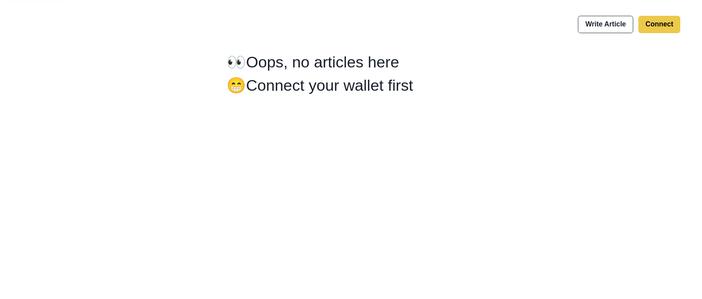
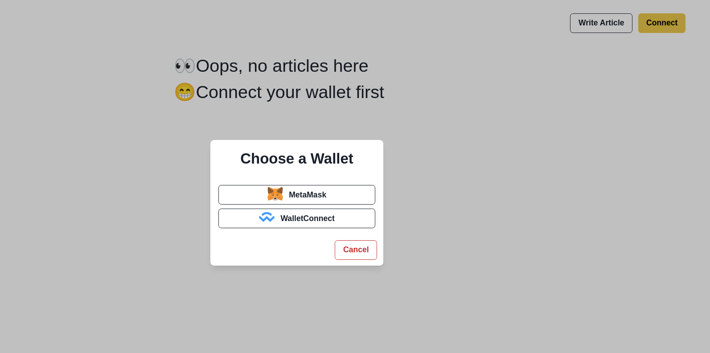
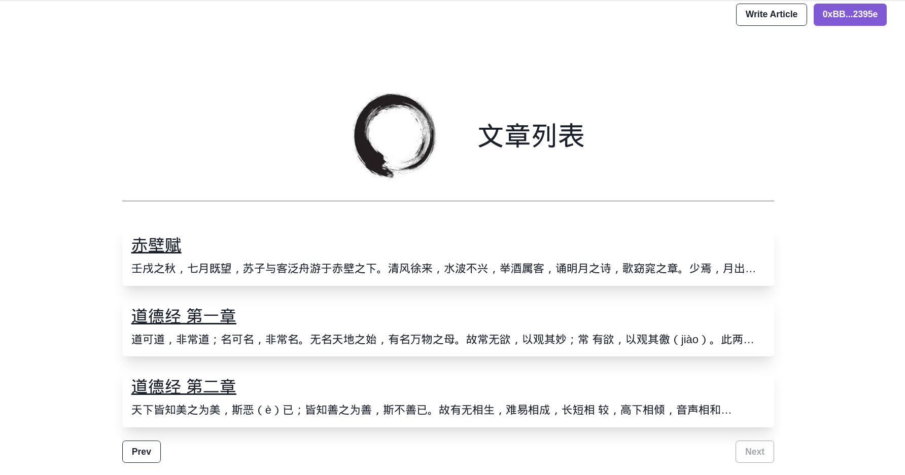
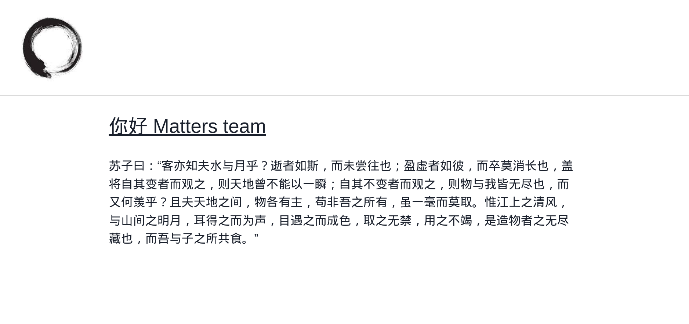

# Full-stack Engineer Challenge

The challenge consists of two parts:
* [Code Challenge](./CodeChallenge.md)
* [Written Challenge](./WrittenChallenge.md)

## Demo
Landing page

Connect wallet

Article list

Article detail



## Get Started

### Client
Run the development server:
```js
npm run dev
# or
yarn dev
```
Open http://localhost:3000 with your browser to see the result.

#### Tech stack
- TypeScript, Next.js
- Tailwindcss, Chakra UI
- apollo/client 

Feature inplemented: Required features plus bouns features.      

### Server
Run the development server:
```
npm run start
```
Open http://localhost:4000 to play around with apollo server playground.


